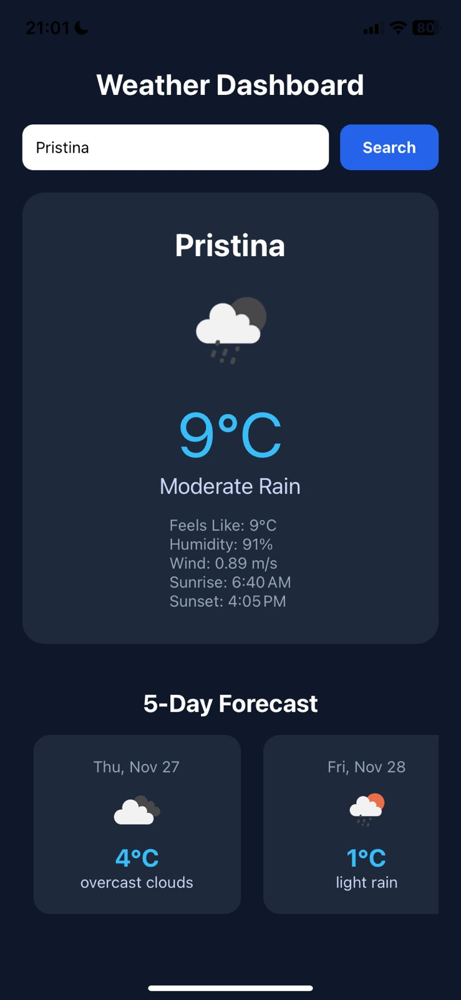

# 🌤️ Dynamic Weather Dashboard App

A responsive and dark-themed **React Native** application built using **Expo**, designed to provide current weather and a 5-day forecast for any city.

This project demonstrates core React Native concepts, conditional rendering (loading/error states), and integration with a third-party REST API (OpenWeatherMap).

---

## 🧭 Table of Contents

* [Overview](#-overview)
* [Screenshots](#-screenshots)
* [Features](#-features)
* [Future Enhancements](#-future-enhancements)
* [Technologies Used](#-technologies-used)
* [Installation](#-installation)
* [Running the Project](#-running-the-project)
* [Author](#-author)

---

## 📝 Overview

**Dynamic Weather Dashboard App** is a clean, minimal, and fully functional mobile weather application. It allows users to search for any city globally, view current conditions, and explore a 5-day forecast with detailed data for each day.

This project emphasizes:

* **API Integration:** Securely fetching and handling data from OpenWeatherMap.
* **State Management:** Utilizing `useState` and `useEffect` for data loading, search results, and displaying modals.
* **Responsive Layout:** Using `Dimensions` and `FlatList` for a user-friendly horizontal forecast scroll.
* **Enhanced Details:** Implementing accurate time formatting for **Sunrise and Sunset** within the detail modal.

---


## 🖼️ Screenshots

| Main Screen (Current Weather) | Forecast Detail Modal |
| :---------------------------: | :-------------------: |
| (assets/WeatherApp1.jpeg) |

---

## ✨ Features

✅ **Current Weather:** Displays temperature, humidity, wind speed, and weather condition for the search city.
✅ **5-Day Forecast:** Shows key weather data for the next five days in a horizontal, scrollable list.
✅ **Detailed Modal View:** Clicking a forecast day opens a modal showing comprehensive details, including pressure, feel-like temperature, and **Sunrise/Sunset times**.
✅ **UX Enhancements:** Includes a **Loading Spinner** (`ActivityIndicator`) and **Error Handling** for city not found or connectivity issues.
✅ **Time Formatting:** Custom helper functions for formatting dates and UNIX timestamps into readable local times.
✅ **Design:** Clean, modern, and professional dark-mode UI/UX.

---

## 🚀 Future Enhancements

* **Saving Favorites:** Implement `AsyncStorage` to save recent or favorite cities.
* **Dynamic Backgrounds:** Implement dynamic backgrounds based on weather conditions (requires `react-native-linear-gradient` dependency).
* **Geolocation:** Add support to fetch weather based on the user's current GPS location.

---

## 💻 Technologies Used

| Technology | Purpose |
| :--- | :--- |
| **React Native** | Frontend framework for mobile UI |
| **Expo** | Development & build environment |
| **JavaScript (ES6+)** | App logic and component structure |
| **OpenWeatherMap API** | Source for current weather and forecast data |
| **StyleSheet API** | Styling components and layout design |

---

## ⚙️ Installation

Follow these steps to set up and run the project locally:

```bash
# 1️⃣ Clone the repository from GitHub
git clone [https://github.com/yourusername/WeatherDashboardApp.git](https://github.com/yourusername/WeatherDashboardApp.git)

# 2️⃣ Navigate into the project directory
cd WeatherDashboardApp

# 3️⃣ Install all dependencies
npm install # or yarn install

```

> 🧩 **Note:** Make sure you have **Node.js** (v18 or above) and the latest **Expo CLI** installed globally.

---

## 🏃 Running the Project

Once all dependencies are installed, start the development server using:

```bash
npx expo start
```
From there, you can:

* 📱 **Scan the QR code** using the **Expo Go** app (available on both Android & iOS).
* 🖥️ Or choose one of the following options directly in the terminal or browser:
    * Press `a` → Run on Android device/emulator
    * Press `i` → Run on iOS simulator (Mac only)
    * Press `w` → Run in your web browser

---

## 👩‍💻 Author

**Alma Muzliukaj**
* 💼 Computer Science Student
* 🌐 https://github.com/almamuzliukaj
* 📧 almamuzliukaj@gmail.com
